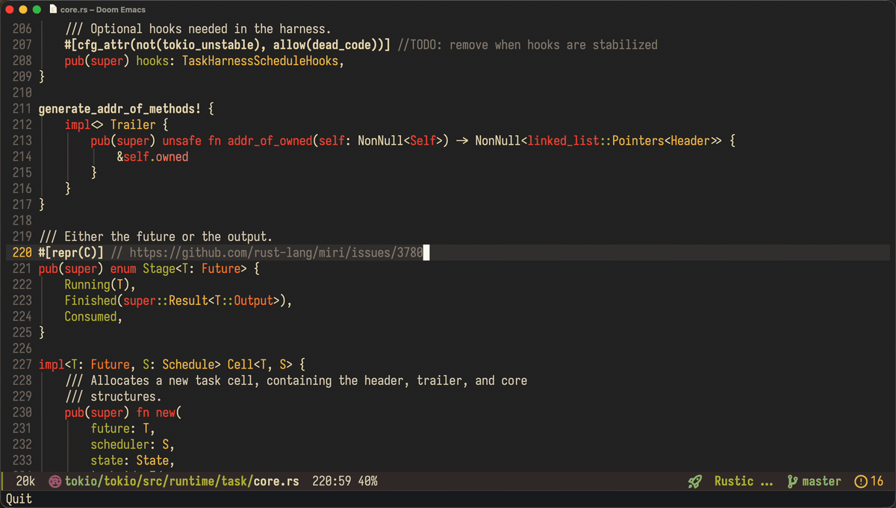

#+TITLE: ast-grep.el
#+AUTHOR: SunskyXH

#+html: 
#+html: 
#+html: 

An Emacs interface to [[https://github.com/ast-grep/ast-grep][ast-grep]], a CLI tool for code structural search, lint and rewriting based on Abstract Syntax Tree patterns.

** Features

- Search code using ast-grep patterns with completing-read interface
- Project-wide search support
- Integration with completing-read frameworks (Vertico, etc.)
- Streaming JSON parsing for efficient processing
- Async search with live results via consult, or via counsel/ivy when ~ivy-mode~ is active
- Interactive rewrite across files (~project-query-replace-regexp~ style)
- In-file symbol navigation via ~ast-grep outline~, exposed through ~imenu~ (so ~consult-imenu~, ~counsel-imenu~, ~imenu-list~, ... all work)

** Requirements

- Emacs 28.1 or later
- [[https://github.com/ast-grep/ast-grep][ast-grep]] CLI tool installed and available in PATH
  - The outline navigation commands require ast-grep 0.44.0 or later
- Optional, for live async search:
  - [[https://github.com/minad/consult][consult]] (pairs with Vertico, Selectrum, etc.), or
  - [[https://github.com/abo-abo/swiper][ivy + counsel]] when ~ivy-mode~ is active

*** Async Backend Support

| Backend selector | Emacs version | Runtime dependency | Selection behavior | Eask sandbox |
|------------------+---------------+--------------------+--------------------+--------------|
| ~auto~           | 28.1+, consult path requires 29.1+ | Optional consult or ivy/counsel | Uses ivy/counsel when ~ivy-mode~ is active and available; otherwise consult when available; otherwise sync | ~eask run script test:full~ |
| ~sync~           | 28.1+ | None | Uses synchronous ~completing-read~ candidates | ~eask run script test:sync~ |
| ~consult~        | 29.1+ | consult (and its dependencies) | Uses consult async search, falling back to sync if consult is unavailable | ~eask run script test:consult~ |
| ~ivy~            | 28.1+ | ivy + counsel | Uses counsel/ivy async search, falling back to sync if ivy/counsel is unavailable | ~eask run script test:ivy~ |

** Installation

~ast-grep~ is available on [[https://melpa.org/#/ast-grep][MELPA]]. Install it using ~M-x package-install~ command or your preferred package manager:

*** use-package

#+begin_src emacs-lisp
(use-package ast-grep :ensure t)
#+end_src

*** Doom Emacs

Add to your ~packages.el~:

#+begin_src emacs-lisp
(package! ast-grep)
#+end_src

*** Straight.el

#+begin_src emacs-lisp
(straight-use-package '(ast-grep :type git :host github :repo "SunskyXH/ast-grep.el"))
#+end_src

*** Manual Installation

1. Clone the repository:
  #+begin_src bash
  git clone https://github.com/SunskyXH/ast-grep.el.git
  #+end_src
2. Add to your Emacs configuration:
  #+begin_src emacs-lisp
  (add-to-list 'load-path "/path/to/ast-grep.el")
  (require 'ast-grep)
  #+end_src
** Usage

*** Interactive Commands

- ~ast-grep-search~ - Search for patterns in current directory
- ~ast-grep-project~ - Search for patterns in current project
- ~ast-grep-directory~ - Search for patterns in specified directory
- ~ast-grep-describe-backend~ - Show the configured backend selector and resolved backend
- ~ast-grep-rewrite~ - Interactive search-and-rewrite in current directory
- ~ast-grep-rewrite-project~ - Interactive search-and-rewrite across the project
- ~ast-grep-outline~ - Jump to a symbol in the current file (picker mirrors the ~ast-grep-search~ backend: ~counsel-imenu~ under ~ivy-mode~, otherwise ~consult-imenu~, with the built-in ~imenu~ as the universal fallback)

~ast-grep-rewrite~ prompts for a pattern and a replacement template,
then walks each match asking ~y~/~n~/~!~/~q~ (yes / skip /
apply-all-remaining / quit), following ~query-replace~ conventions like
~project-query-replace-regexp~. Modified buffers are left for you to
save with ~M-x save-some-buffers~ (~C-x s~).

*** Outline navigation (imenu)

~ast-grep-outline~ asks ~ast-grep outline~ for the symbols in the current
file and lets you jump to one. Symbols are grouped by kind (Classes,
Functions, Methods, ...) and members are qualified with their enclosing
type (e.g. ~Widget.render~). It picks a picker the same way
~ast-grep-search~ picks a backend: under ~ivy-mode~ it uses
~counsel-imenu~ (never ~consult-imenu~), otherwise ~consult-imenu~ when
available, always falling back to the built-in ~imenu~ (which your
completion framework still drives). The outline is read from the file on
disk, so save the buffer to keep positions accurate.

To make ast-grep the imenu source for a buffer permanently, enable
~ast-grep-outline-mode~. Every imenu consumer (~imenu~, ~consult-imenu~,
~counsel-imenu~, ~imenu-list~, ...) then lists ast-grep's symbols:

#+begin_src emacs-lisp
;; e.g. use ast-grep's outline for imenu in TypeScript buffers
(add-hook 'typescript-ts-mode-hook #'ast-grep-outline-mode)
#+end_src

Outline support covers the languages ast-grep ships outline rules for
(TypeScript/JavaScript, Python, Go, Rust, Java, ...). Languages without
outline rules yield an empty index.

*** Minor Mode

Enable ~ast-grep-mode~ for ast-grep integration (useful for configuration hooks).

** Configuration

Customize the following variables:

- ~ast-grep-executable~ - Path to ast-grep executable (default: "ast-grep")
- ~ast-grep-debug~ - Enable debug output for troubleshooting (default: nil)
- ~ast-grep-async-min-input~ - Minimum input length before triggering async search (default: 3)
- ~ast-grep-search-backend~ - Backend for ~ast-grep-search~ (default: ~auto~; accepts ~consult~, ~ivy~, or ~sync~). In ~auto~, active ~ivy-mode~ uses counsel/ivy when available, otherwise consult is used when available, with synchronous ~completing-read~ as the fallback.

** Development

This repository uses Eask to keep optional async backends isolated during
tests. The sync sandbox has no optional completion dependency; consult
and ivy sandboxes install only the backend they exercise.

#+begin_src bash
eask run script compile
eask run script test:sync
eask run script test:consult
eask run script test:ivy
eask run script test:full
#+end_src
